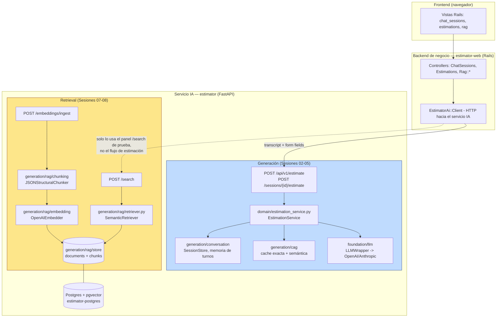
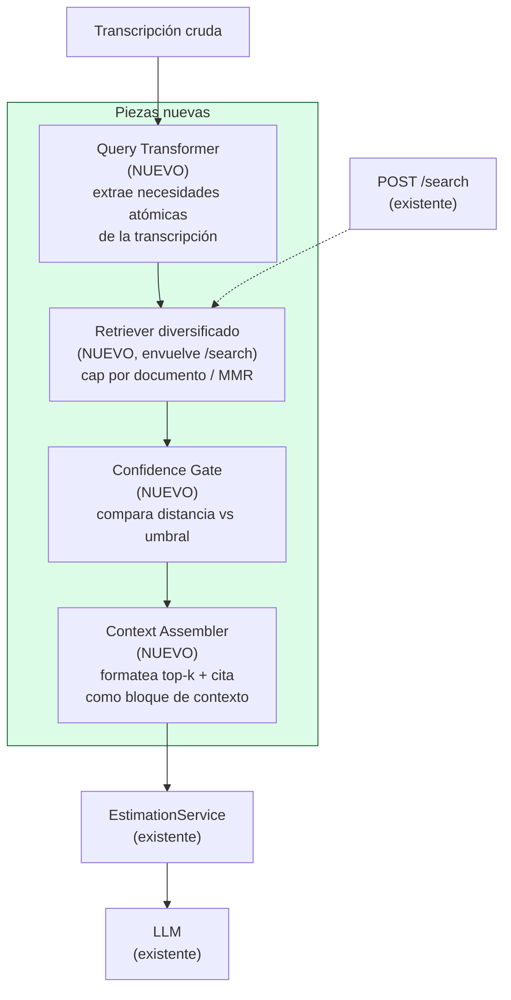

# Diagnóstico arquitectónico — Sesión 09 (pre-work)

## 1. Diagrama de la arquitectura actual



**Dónde acaba lo implementado:** las dos cajas sombreadas (`Generación` y `RAG`) existen y funcionan cada una por separado, pero no hay ninguna flecha entre `Retriever`/`Store` y `EstimationService`. El flujo azul (una transcripción entra y sale una estimación) nunca consulta el flujo amarillo (los presupuestos históricos vectorizados). `POST /search` es un endpoint real y probado, pero hoy solo lo llama quien quiera probarlo a mano — ningún código de producción lo invoca.

---

## 2. Trace anotado de `02_ambiguous.txt`

Sistema levantado con `docker compose up -d estimator-postgres` + `uv run uvicorn app.main:app` en local (puerto 8010 para no chocar con el contenedor), corpus de `data/budgets_sample.json` ya ingestado vía `scripts/query_examples.py` (17 documentos, 60 chunks). Script del trace en [`examples/trace_s09.py`](examples/trace_s09.py).

### Paso 1 — Embeber la transcripción completa

```bash
export OPENAI_API_KEY=sk-...
uv run examples/trace_s09.py examples/transcripts/02_ambiguous.txt
```

```
--- step 1: embed 02_ambiguous.txt directly (OpenAI, model=text-embedding-3-small) ---
dimensions: 1536
l2_norm: 0.999691
first_component: 0.006233
last_component: 0.019012
```

**Comentario:** la norma es prácticamente 1 (OpenAI normaliza sus embeddings), así que la comparación por `cosine_distance` es coherente con lo que hace `pgvector` en la búsqueda del paso 2. El vector en sí no dice nada por sí solo — es un punto en 1536 dimensiones que solo cobra sentido comparado contra otros. Lo interesante es que este vector representa el centroide semántico de **toda** la transcripción de golpe: la tienda física, la venta online, la fidelización, el panel de control y el pago con tarjeta quedan todos mezclados en el mismo vector, sin que ninguno de esos temas destaque sobre los demás.

### Paso 2 — Búsqueda semántica (top-5)

```bash
curl -s -X POST http://localhost:8010/search \
  -H "Content-Type: application/json" \
  -d '{"query": "<contenido completo de 02_ambiguous.txt>", "k": 5}'
```

Respuesta real (recortada a los campos relevantes):

```json
{
  "k": 5,
  "search_time_ms": 1173,
  "results": [
    {"chunk_id": 16, "document_id": 5, "distance": 0.6083,
     "content": "[Project: Headless e-commerce storefront with personalized recommendations] ... Component: Product catalog API ... Tech stack: node, graphql, elasticsearch"},
    {"chunk_id": 17, "document_id": 5, "distance": 0.6138,
     "content": "... Component: Cart and checkout service ... promotion engine, tax calculation ..."},
    {"chunk_id": 18, "document_id": 5, "distance": 0.6372,
     "content": "... Component: Personalized recommendations ... collaborative-filtering ..."},
    {"chunk_id": 19, "document_id": 5, "distance": 0.6387,
     "content": "... Component: Storefront PWA ... next_js, react ..."},
    {"chunk_id": 27, "document_id": 8, "distance": 0.6444,
     "content": "[Project: Fashion returns management and resale portal] ... Component: Returns portal ..."}
  ]
}
```

(JSON completo del comando, con `metadata` de cada chunk, en [`examples/trace_output_02_ambiguous.txt`](examples/trace_output_02_ambiguous.txt).)

### Paso 3 — Lectura de los chunks devueltos

| chunk_id | Presupuesto | Sector | ¿Relevante para lo que pide Rubén? |
|---|---|---|---|
| 16 | BUD-2024-005 — storefront e-commerce headless | ecommerce | Parcial. El cliente quiere vender online, esto es un catálogo con Elasticsearch y multi-moneda — mucho más sofisticado de lo que pide un comerciante que "no tiene ni idea de tecnología". |
| 17 | BUD-2024-005 | ecommerce | Parcial. El carrito/checkout sí es justo lo que pide ("que la gente pueda pagar con tarjeta"), pero el "promotion engine" no es lo mismo que el club de puntos que describe. |
| 18 | BUD-2024-005 | ecommerce | No especialmente. Recomendaciones personalizadas por collaborative filtering no es algo que Rubén haya pedido en ningún momento. |
| 19 | BUD-2024-005 | ecommerce | Poco. Es la parte de front (PWA), tangencial a lo que se está preguntando (funcionalidad de negocio, no stack de UI). |
| 27 | BUD-2024-008 — portal de devoluciones de moda | ecommerce | No. Gestión de devoluciones no aparece por ningún lado en la transcripción. |

Honestamente: el sistema encuentra "algo de ecommerce" y ya está. Ni el club de fidelización/puntos, ni el panel de control con gráficas para el día a día, ni el envío de email al confirmar el pedido —las tres cosas que Rubén pide con más claridad— aparecen en ningún chunk del top-5. Y **4 de los 5 resultados vienen del mismo documento** (BUD-2024-005), lo que hace sospechar que no es que esos chunks sean brillantes, sino que ese documento entero cae en una zona del espacio vectorial más cercana a "ecommerce genérico" que el resto del corpus.

---

## 3. Diagnóstico: cinco fallos identificados

### Fallo 1 — Las distancias del top-5 vienen todas comprimidas en un rango estrecho
- **Problema observado:** en el trace, las 5 distancias van de 0.6083 a 0.6444 — un rango de solo 0.036. No hay ningún resultado que destaque claramente sobre el resto; todo el top-5 "empata".
- **Causa probable:** se embebe la transcripción **completa** (varios párrafos, varios temas) contra chunks de un solo componente (2-4 frases). El vector de la query es un promedio de temas muy distintos (tienda física, ecommerce, fidelización, panel, pagos), así que ningún chunk específico puede alinearse bien con él — todos quedan "medio parecidos".
- **Propuesta de solución:** no comparar la transcripción entera contra chunks pequeños. Hace falta una etapa intermedia que descomponga la transcripción en necesidades más atómicas (o que genere varias queries, una por necesidad) antes de embeber y buscar.

### Fallo 2 — El top-5 no tiene diversidad de documentos
- **Problema observado:** 4 de los 5 chunks devueltos pertenecen al mismo `document_id` (5). Si ese documento no encaja bien, el usuario se queda sin ver ninguna otra alternativa del corpus.
- **Causa probable:** `retriever.py` hace un `ORDER BY embedding <=> query LIMIT k` liso — un ranking global por distancia sin ningún control de "no más de N chunks por documento". Un documento con muchos componentes genéricos (catálogo, carrito, recomendaciones, PWA) puede monopolizar el top-k aunque, presupuesto a presupuesto, no sea el más adecuado.
- **Propuesta de solución:** diversificar el resultado — un tope de chunks por `document_id`, o un re-ranking tipo MMR que penalice resultados muy parecidos entre sí.

### Fallo 3 — Los resultados de `/search` no llegan nunca al generador de estimaciones
- **Problema observado:** revisando el código (`app/domain/estimation_service.py`, `app/api/sessions.py`, `app/api/estimations.py`), ninguno importa ni llama a `generation/rag/retriever.py`. `POST /sessions/{id}/estimate` construye el prompt únicamente a partir del historial de conversación y la metadata extraída — nunca del corpus de presupuestos históricos.
- **Causa probable:** el pipeline de Generación (Sesiones 02-05) y el de Retrieval (Sesiones 07-08) se construyeron como dos ramas independientes del proyecto, cada una con su propio objetivo de sesión, sin que ninguna sesión conectara la salida de una con la entrada de la otra.
- **Propuesta de solución:** una etapa de "Augmentation" explícita entre retrieval y generación: coger el top-k de `/search`, formatearlo como contexto (con su cita: `budget_id`, sector) e inyectarlo en el prompt que ya arma `EstimationService` antes de llamar al LLM.

### Fallo 4 — Ninguno de los tres pedidos explícitos del cliente aparece en el top-5
- **Problema observado:** Rubén pide, con bastante claridad, tres cosas: (1) un programa de puntos/fidelización, (2) un panel de control con gráficas para el día a día, (3) confirmación de pedido por email. Ninguno de los 5 chunks devueltos habla de fidelización, paneles de administración o notificaciones transaccionales.
- **Causa probable:** puede ser cobertura del corpus (17 presupuestos de ejemplo no tienen por qué incluir "programa de puntos"), pero también puede ser el mismo problema del Fallo 1: si esos componentes existen en el corpus pero en otro presupuesto, el ruido de comparar la transcripción entera contra chunks sueltos los está dejando fuera del top-5 a favor de matches más "genéricos".
- **Propuesta de solución:** no se puede arreglar la cobertura del corpus desde la arquitectura, pero si la causa es la segunda, resolver el Fallo 1 (queries más específicas) debería hacer aparecer estos componentes si existen. Además, sería razonable que el sistema pudiera decir "no tengo un match claro para fidelización" en vez de rellenar en silencio con lo más parecido que encontró.

### Fallo 5 — No hay ninguna noción de "esto no es un buen match"
- **Problema observado:** `/search` siempre devuelve exactamente `k` resultados con el mismo formato, tanto si la mejor distancia es 0.2 (muy buena) como si es 0.6 (mediocre, como en este trace). No hay ningún campo ni umbral que distinga ambos casos.
- **Causa probable:** `SearchResponse` (en `generation/rag/schemas.py`) no lleva ningún indicador de confianza — el contrato del endpoint asume que el llamador ya sabe interpretar la distancia cruda.
- **Propuesta de solución:** un umbral de distancia configurable que marque el resultado (o la respuesta completa) como "baja confianza", para que quien consuma la búsqueda (el futuro paso de Augmentation) pueda decidir si usa el contexto tal cual, lo usa con una advertencia, o directamente pide más información al cliente antes de estimar.

---

## 4. Propuesta de evolución arquitectónica



Las piezas nuevas son cuatro y se insertan **entre** lo que ya existe (`/search` a la izquierda, `EstimationService` a la derecha): el **Query Transformer** convierte la transcripción larga y ambigua en una o varias necesidades concretas para buscar (ataca el Fallo 1 y en parte el 4); el **Retriever diversificado** envuelve al `/search` actual sin tocarlo para garantizar variedad de documentos en el resultado (Fallo 2); el **Confidence Gate** decide si la distancia obtenida es suficientemente buena para usarse (Fallo 5); y el **Context Assembler** es el que finalmente conecta ambos mundos, formateando los chunks aceptados como contexto citado dentro del prompt que ya consume `EstimationService` (Fallo 3). El dato que fluye entre ellos es siempre texto + metadata (presupuesto de origen, sector, distancia), nunca el vector en sí — el vector muere dentro de la búsqueda.

Si solo pudiera construir una pieza, sería el **Context Assembler**. Es la única sin la cual las otras tres no sirven de nada: aunque mejore muchísimo la calidad del retrieval, si nadie conecta ese resultado con el prompt de generación, el sistema sigue estimando exactamente igual que hoy — a ciegas, sin ningún presupuesto histórico detrás.
